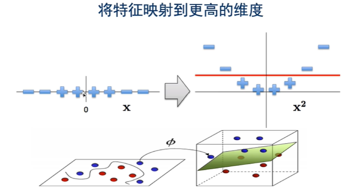

# SVM

## 线性分类器

&emsp;&emsp;图中蓝色的实线和虚线也可把两组点分开，但显然实线分割的效果更好。这也是支持向量机的初衷。

## 支持向量机

&emsp;&emsp;所谓支持向量机是一种分类器，对于做出标记的两组向量，给出一个最优分割超曲面把这两组向量分割到两边，使得两组向量中离此超平面最近的向量（即所谓支持向量）到此超平面的距离都尽可能远。

在分类问题中给定输入数据和学习目标： 
&emsp;&emsp;$X=\{X_1,...,X_N\},y=\{y_1,...,y_N\}$，其中输入数据的每个样本都包含多个特征并由此构成特征空间（feature space）：$X_i=[x_1,...,x_n]\in x$ ，而学习目标为二元变量$y\in\{-1,1\}$表示负类（negative class）和正类（positive class）。

&emsp;&emsp;若输入数据所在的特征空间存在作为**决策边界**（decision boundary）的超平面将学习目标按正类和负类分开，并使任意样本的**点到平面距离**大于等于1 ：

$$decision-boundary:w^T+b=0$$
$$point-to-plane-distance:y_i(w^TX_i+b)\geq 1$$

则称该分类问题具有线性可分性，参数w, b分别为超平面的法向量和截距。

&emsp;&emsp;满足该条件的决策边界实际上构造了2个平行的超平面作为间隔边界以判别样本的分类：
$$w^TX_i+b\geq+1, \Rightarrow y_i=+1$$
$$w^TX_i+b\leq-1, \Rightarrow y_i=-1$$

&emsp;&emsp;所有在上间隔边界上方的样本属于正类，在下间隔边界下方的样本属于负类。两个间隔边界的距离$d=\frac{2}{||w||}$被定义为边距（margin），位于间隔边界上的正类和负类样本为支持向量（support vector）。

$$
w^Tx_1+b=1//
w^Tx_2+b=-1//
(w^Tx_1+b)-(w^Tx_2+b)=2\\
w^T(x_1-x_2)=2\\
d_1=d_2=\frac{w^T(x_1-x_2)}{2||w||_2}=\frac{1}{||w||_2}=\frac{\frac{w^T}{||w||_2}(x_1-x_2)}{2}\\
d_1+d_2=\frac{2}{||w||_2}
$$

### SVM数学模型
$$
\underset {w,b}{min}\frac{1}{2}w^Tw\\
s.t.y_i(w^Tx_i+b)\geq1,i=1,...,n\\
h(x)=sign(w^T+b)
$$
&emsp;&emsp;要使得w与w的点积最小，w的模的平方最小，即$\frac{2}{||w||}$最大，所以SVM有时也叫最大间隔分类器(Max-Margin Classifier).

&emsp;&emsp;w为0就最小，但无意义。约束条件希望两族点远离边界。

&emsp;&emsp;h(x)做预测，sign符号函数：
$$
h(x)=sign(w^Tx+b)=
\begin{cases}
1, & w^Tx+b>0\\
-1, & w^Tx+b<0
\end{cases}
$$

### SVM异常值(outlier)

如果按照SVM的定义应该是虚线为分割线。但它不是最好的分割，属于同一类别的点应该相似，存在异常点。实线显然可以应对更常用的情况。

#### 处理方法：

- 处理一：不放松限制

- 处理二：放松限制

- 处理三：必须放松限制

### 带松弛变量的 SVM数学模型

$$
\underset {w,b,\xi>0}{min}\frac{1}{2}w^Tw+C\sum_i\xi_i\\
\begin{aligned}
s.t.y_i(w^Tx_i+b)&\geq 1-\xi_i,i=1,...,n\\
\xi&\geq 0\\
h(x)=sign(w^Tx+b)
\end{aligned}
$$

### Hinge Loss (合页损失函数)
$$
y_i(w^Tx_i+b)\geq 1-\xi_i ,\xi_i\geq 0 \mapsto \xi_i\geq 1-y_i(w^Tx_i+b) \\
\mapsto \xi_i=max(0,1-y_i(w^Tx_i+b))
$$

- Convex凸函数，容易优化
- 在自变量小于0的部分梯度比较小，对错误分类的惩罚比较轻
- 在自变量大于等于1的部分，值为0:只要对某个数据分类是正确的，并且正确的可能性足够高，那么就用不着针对这个数据进一步优化了
- 在自变量等于0处不可导，需要分段求导
- 使得在求解最优化时，只有支持向量(supportvector)会参与确定分界线，而且支持向量的个数远小于训练数据的个数

### 求解 SVM数学模型
方法一：二次规划(Quadratic Programming)，经典运筹学的最优化问题，可以在多项式时间内求得最优解

方法二：转换为对偶问题

### 扩展到支持多个类别
两种方法:
1.OVR(one versus rest):对于K个类别的情况，训练K个SVM，第j个SVM用于判断任意条数据是属于类别j还是属于类别非j.预测的时候，具有最大值的$w^T_ix+b_i$ 表示给定的数据x属于类别i。

2.OVO(one versus one),对于K个类别的情况，训练K*(K-1)/2个SVM，每一个 SVM只用于判读任意条数据是属于K中的特定两个类别.预测的时候,使用K*(K-1)/2个SVM做K*(K-1)/2次预测，使用计票的方式决定数据被分类为哪个类别的次数最多，就认为数据x属于此类别。

## SVM 拓展(将带松弛变量的 SVM最优化问题，添加拉格朗日算子，转化为一个新的最优化问题)
原问题(最小化)：
$$
\underset {w,b,\xi>0}{min}\frac{1}{2}w^Tw+C\sum_i\xi_i\\
\begin{aligned}
s.t.y_i(w^Tx_i+b)&\geq 1-\xi_i,i=1,...,n\\
\xi&\geq 0\\
h(x)=sign(w^Tx+b)
\end{aligned}
$$
新问题(最大化)：
$$
\begin{aligned}
L(w,b,\xi,\alpha,\lambda) &= \frac{1}{2}w^Tw+C\sum_i{\xi_i}+\sum_i\alpha_i(1-\xi_i-y_i(w^Tx_i+b))-\sum_i\lambda_i\xi_i \\
\frac{\partial L}{\partial b}&=0 \mapsto \sum_i\alpha_iy_i=0\\
\frac{\partial L}{\partial w}&=0 \mapsto w = \sum_i\alpha_iy_ix_i\\
\frac{\partial L}{\partial \xi_i}&=0 \mapsto C-\alpha_i-\lambda_i=0\\
带入w=\sum_i\alpha_iy_ix_i,\sum_i\alpha_iy_i=0\\
L(\xi,\alpha,\lambda) &= \sum_i\alpha_i - \frac{1}{2}\sum_{i,j}\alpha_i\alpha_jy_iy_jx^T_ix_j+\sum_i\xi_i(C-\alpha_i-\lambda_i)\\
带入C-\alpha_i-\lambda_i=0\\
\underset{\alpha\geq0,\lambda\geq0}{max}\sum_i\alpha_i - \frac{1}{2}\sum_{i,j}\alpha_i\alpha_jy_iy_jx^T_ix_j\\
s.t. \sum_i\alpha_iy_i=0,C-\alpha_i-\lambda_i=0
\end{aligned}
$$

$$
\underset{\alpha\geq0,\lambda\geq0}{max}\sum_i\alpha_i - \frac{1}{2}\sum_{i,j}\alpha_i\alpha_jy_iy_jx^T_ix_j\\
s.t. \sum_i\alpha_iy_i=0,C-\alpha_i-\lambda_i=0\\

由于\lambda_i唯一需要满足的条件是大于等于0，约束条件C-\alpha_i-\lambda_i=0也可以改为：\alpha_i\leq C
$$

## SVM的对偶形式

## 使用核函数
$$
\underset{\alpha\geq0,\lambda\geq0}{max}\sum_i\alpha_i - \frac{1}{2}\sum_{i,j}\alpha_i\alpha_jy_iy_jk(x_i,x_j)\\
s.t. \sum_i\alpha_iy_i=0,\alpha_i\leq C\\
k(x_i,x_j)=<\phi(x_i),\phi(x_j)>\\
使用核函数k(x_i,x_j)代替x_i^Tx_j
$$

### The Kernel Trick(核技巧)
- 如果一个算法可以表达为关于一个正定核K1的函数，那么可以将它转化为关于另外一个正定核K2的函数
- SVM可以使用The Kernel Trick

### 使用核函数，预测公式
$$
b=y_i-\sum_j\alpha_jy_jk(x_j,x_i), \forall i, C>\alpha_i>0\\
w^T\phi(x)+b=\sum_i\alpha_iy_ik(x_i,x)+b\\
只有当x_i为支持向量的时候，\alpha_i>0
$$ 

$$
\phi:\chi \mapsto \hat\chi=\phi(x)\\
\phi([x_{i1},x_{i2}])=[x_{i1},x_{i2},x_{i1}x_{i2},x_{i1}^2,x_{i2}^2]
$$

## 直接扩展到高维的问题
一、增加了计算量

&emsp;&emsp;计算量与数据量和每一条数据的维度正相关

二、没办法增加到无限维

&emsp;&emsp;核函数可以

## 成为Kernel条件

$K(x_i,x_j)=<\phi(x_i),\phi(x_i)>$

Gram矩阵：
$$G_{ij}=K(x_i,x_j)$$
一.为对称矩阵

二.为半正定矩阵$z^TGz\geq0,x\in R^n$

## 多项式核(Polynomial Kernel)
$$K(x_i,x_j)=(<x_i,x_j>+c)^d$$
- $C\geq0$控制低阶项的强度
- 特殊情况，当$c=0,d=1$成为线性核(Linear Kernel),就于无核函数的SVM一样
$$K(x_i,x_j)=<x_i,x_j>$$

### 多项式核例子
$$
x_i=[x_{i1},x_{i2}],x_i=[x_{j1},x_{j2}]\\
\begin{aligned}
K(x_i,x_j)&=<x_i,x_j>^2\\
&=(x_{i1}x_{j1})\\
&=(x_{i1}^2x_{j1}^2+x_{i2}^2x_{j2}^2+2x_{i1}x_{i2}x_{j1}x_{j2})\\
&=<\phi(x_i),\phi(x_j)>\\
\phi(x_i)=[x_{i1}^2,x_{i2}^2,2x_{i1}x_{i2}]\\
\phi(x_j)=[x_{j1}^2,x_{j2}^2,2x_{j1}x_{j2}]
\end{aligned}
$$

## 高斯核(Gaussian Kernel),也称为 Redial Basis Function(RBF) Kernel
$$K(x_i,x_j)=exp(-\frac{||x_i-x_j||_2^2}{2\sigma^2})$$
&emsp;&emsp;当$x_i=x_j$,值为1，当$x_i$与$x_j$距离增加，值倾向于0使用高斯核之前需要将特征正规化(因为要相减)

### 高斯核例子

## Sigmoid Kernel
&emsp;&emsp;此时的SVM等价于一个没有隐含层的简单神经网络
$$
K(x_i,x_j)=\tanh(\alpha x_i^Tx_j+c)
$$

## Cosine Similarily Kernel
- 常用于衡量两段文字的相似性
- 相当于衡量两个向量的余弦相似度
(向量夹角的余弦值)
$$K(x_i,x_j)=\frac{x_i^Tx_j}{||x_i||||x_j||}$$

## Chi-seqared Kernel
- 常用于计算机视觉
- 衡量两个概率分布的相似度
- 输入数据必须是非负的，并且使用了L1归一化(L1 Normalized)
$$K(x_i,x_j)=\frac{x_i^Tx_j}{||x_i||||x_j||}$$

## 总结

&emsp;&emsp;SVM专注于找最优的分界线，用于减少过拟合

&emsp;&emsp;Kernel Trick的应用使得SVM可以高效的用于非线性可分的情况

优势:
- 理论非常完美

- 支持不同Kernel，用于调参

- 模型只需要保存支持向量，模型占用内存少，预测快
- 分类只取决于支持向量，适合数据的维度高的情况，例如DNA数据

缺点:

- 当数据量特别大时，训练比较慢

- 训练的时间复杂度为O[N3]或者至少O[N]当数据量巨大时候不合适使用
- 需要做调参C当数据量大时非常耗时间.

